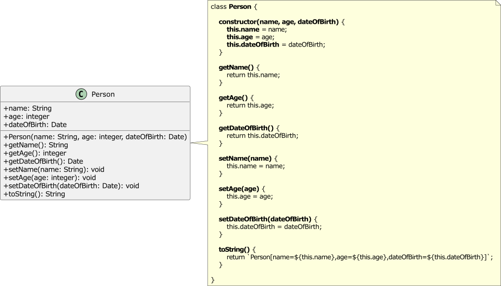
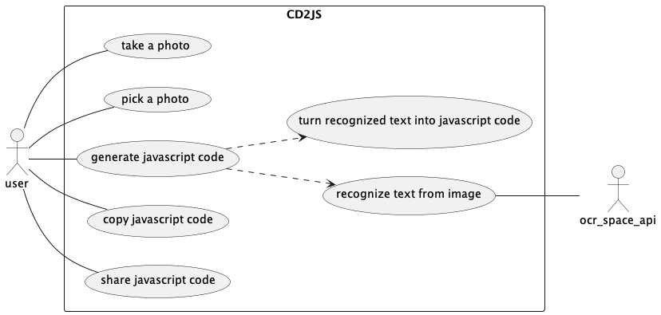
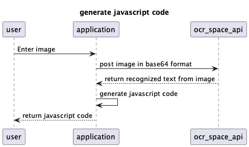
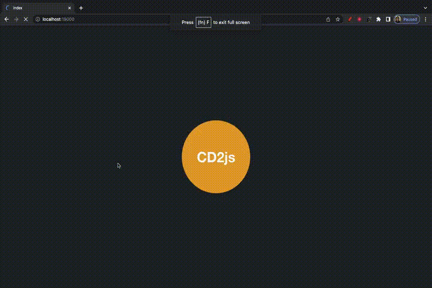

# CD2js

## simple example

## Agent Design (PEAS)

<table>
    <tr>
        <th>Performance</th>
        <td>Fast ,minimize cost ,maximize accurate</td>
    </tr>
    <tr>
        <th>Environment</th>
        <td>Mobile ,digital photos ,Papers</td>
    </tr>
    <tr>
        <th>Actuators</th>
        <td>Turn class diagrams into javascript code</td>
    </tr>
    <tr>
        <th>Sensors</th>
        <td>Cameras ,include file input field</td>
    </tr>
</table>

## Environment properties (ODESDA)
<table style="text-align: center;">
    <tr>
        <th>Observable</th>
        <th>Deterministic</th>
        <th>Episodic</th>
        <th>Static</th>
        <th>Discrete</th>
        <th>Agent</th>
    </tr>
    <tr>
        <td>Yes</td>
        <td>No</td>
        <td>Yes</td>
        <td>Yes</td>
        <td>Yes</td>
        <td>Single</td>
    </tr>
</table>

## Agent type 
<table>
    <tr>
        <th>Agent type</th>
        <td>learning agent</td>
        <td>
            OCR systems use machine learning to recognize handwritten and printed text.
        </td>
    </tr>
</table>

## Use case diagram

## Sequence diagram

## Preview on web (dark mode)

## Preview on mobile

<article 
    style = "
                display: flex;
                gap: 3rem;
                justify-content: space-around;
            "
>
    <section>
        <h3>IOS (dark mode)</h3>
        
    </section>
    <section>
        <h3>Android (light mode)</h3>
        
    </section>
</article>